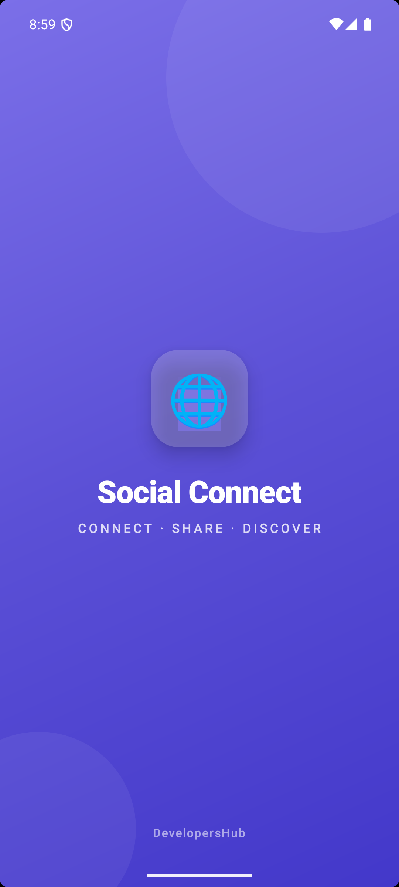
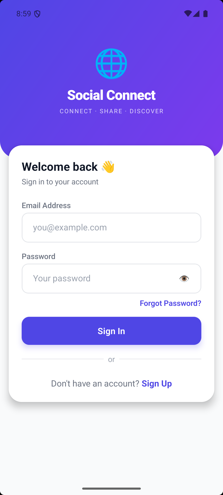
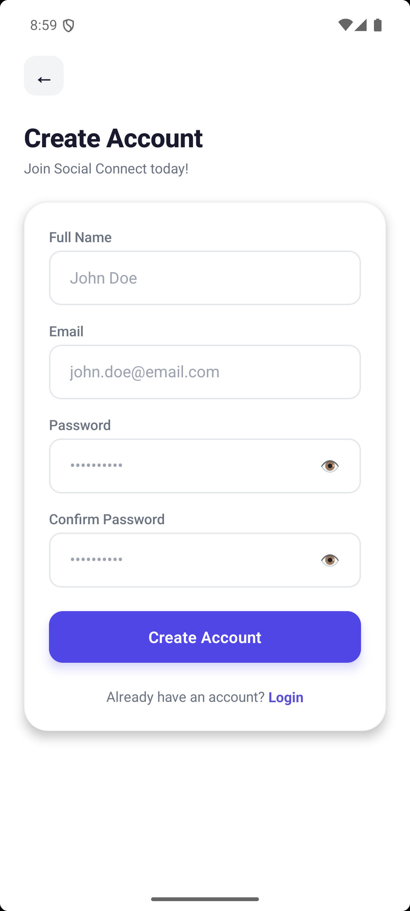
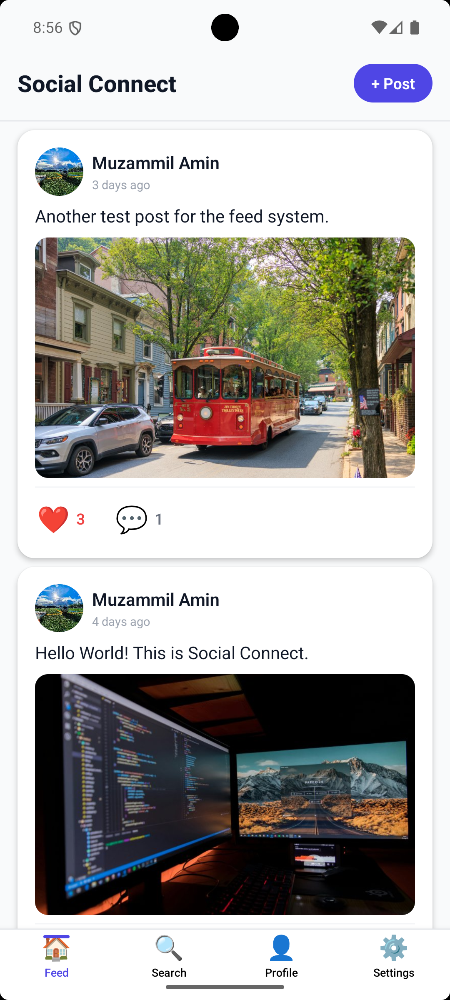
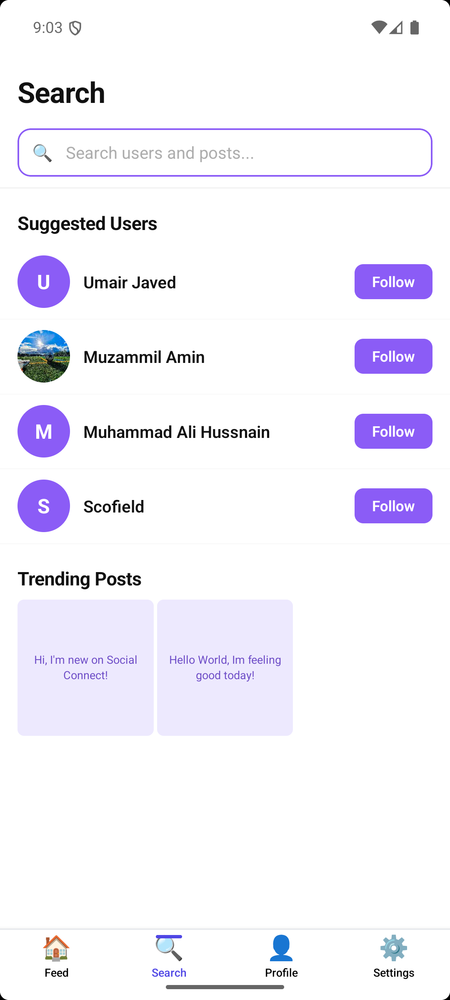
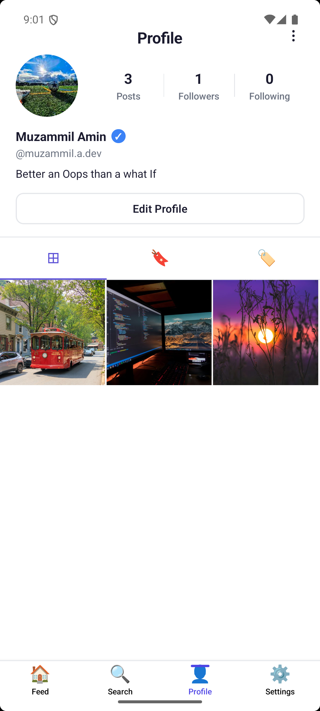
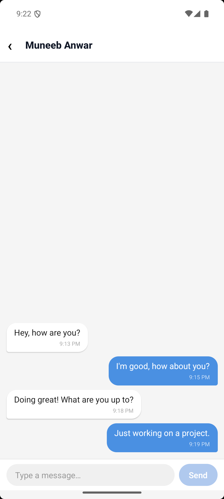
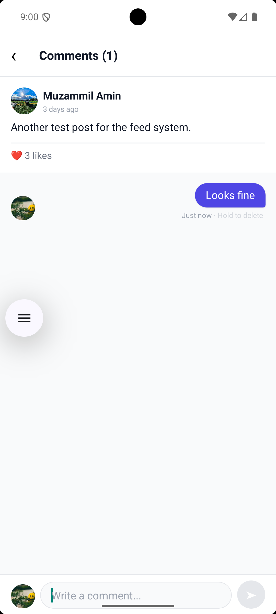
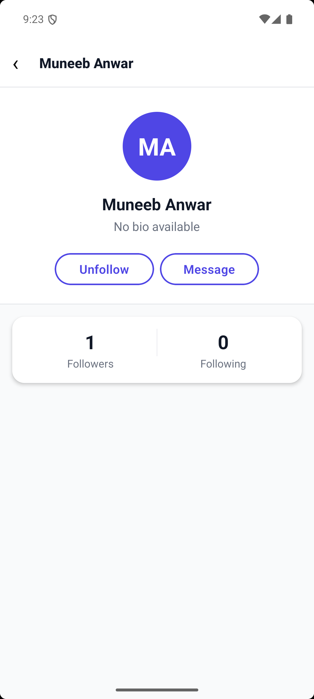
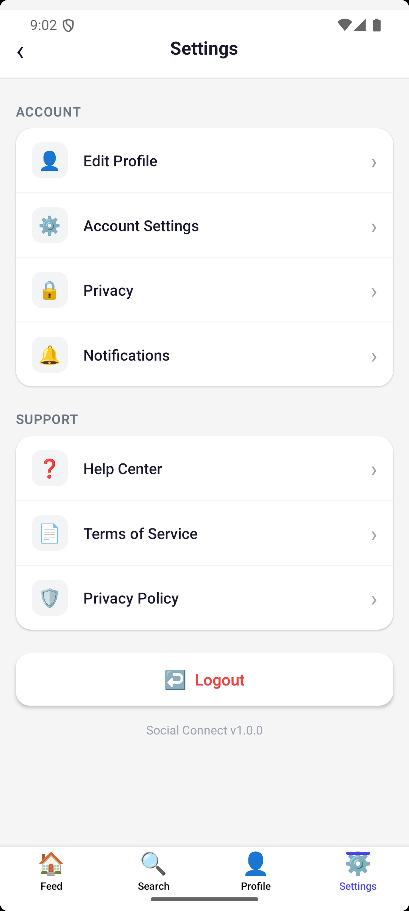

# Social Connect📱
"A social media app built with React Native."

---

## 📸 Screenshots

### Onboarding
| Splash Screen | Sign In | Sign Up |
|--------------|---------|---------|
|  |  |  |

### Core Features
| Home Feed | Search | Profile |
|-----------|--------|---------|
|  |  |  |

### Social Features
| Messages | Comments | User Profile | Settings |
|----------|----------|--------------|----------|
|  | |  |
|  |  |

## 🎥 Video Demo
[Watch Demo Here](https://drive.google.com/file/d/1BQc_0bilNRTyx7mzaQVlAOGoCx8zbwtU/view?usp=sharing)

---

## ✨ Features

- 🔐 **Authentication** — Sign up, log in, and secure session persistence
- 👤 **User Profile** — View and edit profile info, avatar, and bio
- 📝 **Posts** — Create, view, and delete posts with image support
- ❤️ **Likes** — Like and unlike posts with real-time count updates
- 💬 **Comments** — Add and view comments on posts
- 👥 **Follow / Unfollow** — Follow other users and manage your feed
- 📰 **Feed** — Personalized feed based on who you follow
- 📨 **Real-time Messaging** — One-on-one chat powered by Firestore
- 🔔 **Push Notifications** — In-app and background notifications via FCM
- 🌐 **Offline Awareness** — Network status detection with graceful fallback

---

## 🛠 Tech Stack

- **Framework:** React Native 0.84.1 (CLI) with TypeScript
- **Backend & Services:** Firebase (Auth, Firestore, Cloudinary, Messaging)
- **Navigation:** React Navigation v7 (Native Stack, Bottom Tabs, Stack)
- **State Management:** Redux Toolkit + React Redux + Redux Persist
- **UI & Animations:** Lottie, React Native Reanimated, Linear Gradient, Vector Icons
- **Forms & Validation:** Formik + Yup
- **Notifications:** Firebase Cloud Messaging
- **Media:** React Native Image Picker
- **Utilities:** AsyncStorage, NetInfo, Day.js, React Native UUID, Responsive Dimensions
---

## ⚙️ Getting Started

### Prerequisites
Make sure you have the following installed:
- Node.js >= 18
- React Native CLI
- Android Studio (for Android)
- Xcode (for iOS — Mac only)

### Install dependencies
npm install

### iOS only — install pods (Mac only)
cd ios && pod install && cd ..

---

## ▶️ Running the App

### Android
npx react-native run-android

### iOS
npx react-native run-ios

### Environment Setup
Create a `.env` file in the root directory:
```env
# Firebase
FIREBASE_API_KEY=your_api_key_here
FIREBASE_AUTH_DOMAIN=your_project_id.firebaseapp.com
FIREBASE_PROJECT_ID=your_project_id_here
FIREBASE_STORAGE_BUCKET=your_project_id.appspot.com
FIREBASE_MESSAGING_SENDER_ID=your_sender_id_here
FIREBASE_APP_ID=your_app_id_here

# Cloudinary
CLOUDINARY_CLOUD_NAME=your_cloud_name_here
CLOUDINARY_UPLOAD_PRESET=your_upload_preset_here
```

## 📦 Build for Production

### Android APK
```bash
cd android
./gradlew assembleRelease
```

## 📁 Project Structure
src/
├── assets/          # Images, screenshots, animations
├── components/      # Reusable UI components
├── navigation/      # React Navigation setup
├── screens/         # App screens
├── store/           # Redux Toolkit slices & store
├── services/        # Firebase & API calls
└── utils/           # Helper functions

## 👤 Author
**Muhammad Muzamil Amin**  
GitHub: [@muzammilamindev](https://github.com/muzammilamindev)